# 环境准备

使用VMWare 虚拟机上的Ubuntu14.04LTS，安装Vivado2016.2。

## Vivado16.2启动报错

```Bash
white@ubuntu:~/Desktop/vivado_launch$ vivado

****** Vivado v2016.2 (64-bit)
  **** SW Build 1577090 on Thu Jun  2 16:32:35 MDT 2016
  **** IP Build 1577682 on Fri Jun  3 12:00:54 MDT 2016
    ** Copyright 1986-2016 Xilinx, Inc. All Rights Reserved.

CRITICAL WARNING: [Common 17-741] No write access right to the local Tcl store at '/home/white/.Xilinx/Vivado/2016.2/XilinxTclStore'. XilinxTclStore is reverted to the installation area. If you want to use local Tcl Store, please change the access right and relaunch Vivado.
ERROR: [Common 17-1257] Failed to create directory '/opt/Xilinx/Vivado/2016.2/tclapp'.
start_gui
Error: Failed to save the Vivado user preferences file. Reason: '/home/white/.Xilinx/Vivado/2016.2/vivado.ini (Permission denied)'
Failed to create the shortcut directory: '/home/white/.Xilinx/Vivado/2016.2/shortcuts'
Failed to create the layout directory: '/home/white/.Xilinx/Vivado/2016.2/layouts/application'
Failed to create the commands directory: '/home/white/.Xilinx/Vivado/2016.2/commands'
Failed to create the layout directory: '/home/white/.Xilinx/Vivado/2016.2/layouts/'
Failed to create directory: /home/white/.profile
Error: Failed to save the Vivado user preferences file. Reason: '/home/white/.Xilinx/Vivado/2016.2/vivado.ini (Permission denied)'
Error: Failed to save the Vivado user preferences file. Reason: '/home/white/.Xilinx/Vivado/2016.2/vivado.ini (Permission denied)'
INFO: [Common 17-206] Exiting Vivado at Wed Nov 22 06:35:42 2023...

```

参考：
[Vivado Engine out of memory (xilinx.com)](https://support.xilinx.com/s/question/0D52E00006hpsdPSAQ/vivado-engine-out-of-memory?language=en_US)

导致报错的有两个原因：

### 引擎内存不够

使用建议最大内存（13.4GB）。
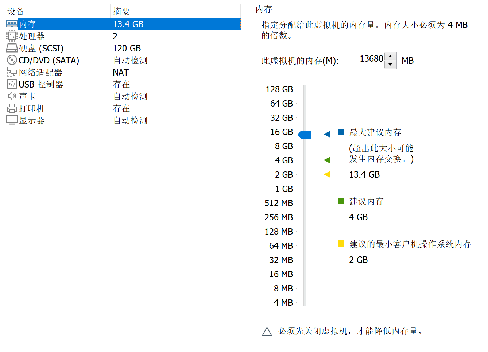

>如果很卡，可以尝试将主机其他运行软件关闭（使得windows系统认为VMware是主要的进程），再打开。

### Vivado16.02的权限问题

在2023.2版本中我没有遇到过这种问题，尝试几种与root权限有关的方法失败后，我决定不再在这上面 浪费时间，将Vivado卸载，重新安装在~/opt/Xilinx目录下。
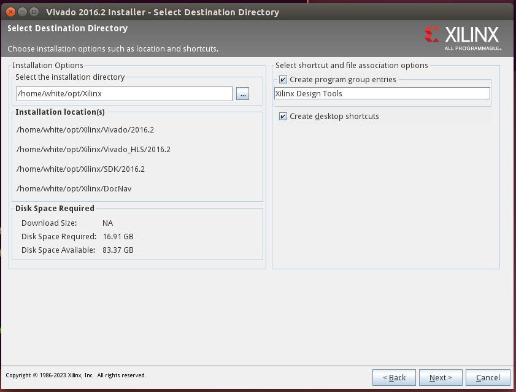

但是竟然还是报错。
```Bash
white@ubuntu:~/Desktop/vivado_launch$ vivado

****** Vivado v2016.2 (64-bit)
  **** SW Build 1577090 on Thu Jun  2 16:32:35 MDT 2016
  **** IP Build 1577682 on Fri Jun  3 12:00:54 MDT 2016
    ** Copyright 1986-2016 Xilinx, Inc. All Rights Reserved.

CRITICAL WARNING: [Common 17-741] No write access right to the local Tcl store at '/home/white/.Xilinx/Vivado/2016.2/XilinxTclStore'. XilinxTclStore is reverted to the installation area. If you want to use local Tcl Store, please change the access right and relaunch Vivado.
ERROR: [Common 17-1257] Failed to create directory '/home/white/opt/Xilinx/Vivado/2016.2/tclapp'.
start_gui
Error: Failed to save the Vivado user preferences file. Reason: '/home/white/.Xilinx/Vivado/2016.2/vivado.ini (Permission denied)'
Error: Failed to save the Vivado user preferences file. Reason: '/home/white/.Xilinx/Vivado/2016.2/vivado.ini (Permission denied)'
Error: Failed to save the Vivado user preferences file. Reason: '/home/white/.Xilinx/Vivado/2016.2/vivado.ini (Permission denied)'
INFO: [Common 17-206] Exiting Vivado at Wed Nov 22 19:31:46 2023...
white@ubuntu:~/Desktop/vivado_launch$ 
```

参考：
[Vivado Ubuntu installation error - java.lang.ClassCastException (xilinx.com)](https://support.xilinx.com/s/question/0D52E00006iHkc5SAC/vivado-ubuntu-installation-error-javalangclasscastexception?language=en_US)
[62240 - 2014.3 Install - When installed as normal user using sudo on Ubuntu, running Vivado gives: Error: Failed to save the Vivado user preferences file. Reason: '/home/user/.Xilinx/Vivado/2014.3/vivado.ini (Permission denied)'](https://support.xilinx.com/s/article/62240?language=en_US)

在ubuntu14.04 LTS下进行实验：
```Bash
white@ubuntu:~/Desktop$ sudo mkdir test
white@ubuntu:~/Desktop$ ll
total 16
drwxr-xr-x  4 white white 4096 Nov 22 19:27 ./
drwxr-xr-x 21 white white 4096 Nov 22 18:34 ../
drwxr-xr-x  2 root  root  4096 Nov 22 19:27 test/
drwxrwxr-x  2 white white 4096 Nov 22 19:26 vivado_launch/

```

sudo权限下创建的文件夹，普通用户只具备r-x的权限（虽然可以重命名）。
ubuntu18 LTS下实验结果也是一致的，说明这不是ubuntu版本特点的问题，而是vivado16.02的问题（在Ubuntu18 LTS+Vivado2019.1环境下进行测试，没有这个启动报错问题），**vivado16.02需要向root权限下创建的目录下写东西**。

同时可以看出sudo ./xsetup之后，创建的目录都是普通用户无法访问的：
```Bash
white@ubuntu:~$ ll
total 136
drwxr-xr-x 21 white white 4096 Nov 22 18:34 ./
drwxr-xr-x  3 root  root  4096 Nov 22 01:53 ../
-rw-------  1 white white 3538 Nov 22 09:17 .bash_history
-rw-r--r--  1 white white  220 Nov 22 01:53 .bash_logout
-rw-r--r--  1 white white 3751 Nov 22 09:16 .bashrc
drwx------ 16 white white 4096 Nov 22 04:44 .cache/
drwx------ 15 white white 4096 Nov 22 04:25 .config/
drwxrwxr-x  3 white white 4096 Nov 22 04:05 data/
drwx------  3 white white 4096 Nov 22 05:21 .dbus/
drwxr-xr-x  4 white white 4096 Nov 22 19:27 Desktop/
-rw-r--r--  1 white white   25 Nov 22 02:01 .dmrc
drwxr-xr-x  2 white white 4096 Nov 22 04:14 Documents/
drwxr-xr-x  2 white white 4096 Nov 22 05:11 Downloads/
-rw-r--r--  1 white white 8980 Nov 22 01:53 examples.desktop
drwx------  3 white white 4096 Nov 22 18:34 .gconf/
-rw-------  1 white white 3816 Nov 22 18:34 .ICEauthority
drwxrwxr-x  4 white white 4096 Nov 22 06:31 .java/
drwx------  3 white white 4096 Nov 22 02:01 .local/
drwx------  5 white white 4096 Nov 22 02:29 .mozilla/
drwxr-xr-x  2 white white 4096 Nov 22 02:01 Music/
drwxr-xr-x  3 root  root  4096 Nov 22 08:54 opt/
drwxrwxr-x  2 white white 4096 Nov 22 09:17 .oracle_jre_usage/
drwxr-xr-x  2 white white 4096 Nov 22 02:01 Pictures/
-rw-r--r--  1 white white  675 Nov 22 01:53 .profile
drwxr-xr-x  2 white white 4096 Nov 22 02:01 Public/
drwxr-xr-x  2 white white 4096 Nov 22 02:01 Templates/
drwxr-xr-x  2 white white 4096 Nov 22 02:01 Videos/
-rw-------  1 root  root   901 Nov 22 09:16 .viminfo
-rw-------  1 white white   51 Nov 22 18:34 .Xauthority
drwxr-xr-x  3 root  root  4096 Nov 22 06:19 .Xilinx/
-rw-------  1 white white  108 Nov 22 18:34 .xsession-errors
-rw-------  1 white white 1431 Nov 22 09:17 .xsession-errors.old

```

很容易想到解决办法：不用sudo，直接./xsetup

遇到下面问题：
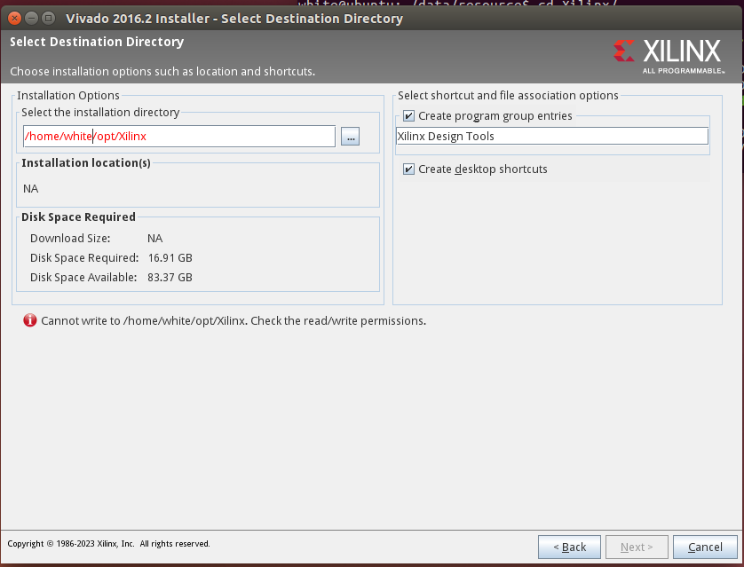

重试？有点难绷，重试就好用了，，，

## python2

ubuntu14.04LTS自带python2。
## JDK 8

安装jdk8失败：
```Bash
white@ubuntu:~$ sudo apt-get install openjdk-8-jdk
Reading package lists... Done
Building dependency tree       
Reading state information... Done
E: Unable to locate package openjdk-8-jdk

```

参考博客：
[ubuntu安装java环境报错 - ardyh - 博客园 (cnblogs.com)](https://www.cnblogs.com/ardyh/p/14533216.html)

添加apt源：
```Bash
sudo add-apt-repository ppa:openjdk-r/ppa 
sudo apt-get update 
sudo apt install openjdk-8-jdk
```

## Device Tree Compiler

需要安装`Device Tree Compiler`：

```Bash
sudo apt-get install device-tree-compiler
```

## git 总是失败怎么办

下面过程中的make命令可能涉及git拉取比较大的工程代码，可以参考下面（以拉取linux-xlnx为例）编写一个重复git直至成功的shell脚本。

网络原因git总是失败怎么办，编写一个重复git直至成功的脚本test.sh：

```Bash
git submodule update --init /home/white/data/code/riscv-zynq/fpga-zynq/common/linux-xlnx
while [ $? -gt 0 ];  
do  
git submodule update --init /home/white/data/code/riscv-zynq/fpga-zynq/common/linux-xlnx    
done
```

# 过程记录

## 创建ax7z100工程

创建ax7z100目录，创建Makefile文件和工程结构：
```text
BOARD = ax7z100
UBOOT_CONFIG = $(BOARD)
PART = xc7z100ffg900-2
CONFIG = ZynqFPGAConfig

include ../common/Makefrag
```

工程结构（目录先空着，不急着放文件）：
```Bash
white@ubuntu:~/data/code/riscv-zynq/fpga-zynq/ax7z100$ tree
.
├── Makefile
├── soft_config
└── src
    ├── constrs
    ├── tcl
    └── verilog

5 directories, 1 files

```

## make init-submodules

执行make init-submodules命令，clone子模块有关代码。

## make rocket

make rocket（使用Makefile里的配置）更换common目录下有关文件的配置信息。make rocket后，生成Top.ZynqFPGAConfig.v：
```Bash
white@ubuntu:~/data/code/riscv-zynq/fpga-zynq/ax7z100$ tree
.
├── Makefile
├── soft_config
└── src
    ├── constrs
    ├── tcl
    └── verilog
        └── Top.ZynqFPGAConfig.v

5 directories, 2 files

```

## make project

make project之前，需要对工程结构有个大致的理解。

参考zybo（同样没有board model）：
```Bash
white@ubuntu:~/data/code/riscv-zynq/fpga-zynq/zybo$ tree
.
├── fpga-images-zybo
├── Makefile
├── soft_config
│   ├── boards.cfg
│   ├── zybo_devicetree.dts
│   └── zynq_zybo.h
└── src
    ├── constrs
    │   └── base.xdc
    ├── tcl
    │   └── zybo_bd.tcl
    ├── verilog
    │   └── clocking.vh
    └── xml
        └── ZYBO_zynq_def.xml

7 directories, 8 files


```

参考zc706（芯片参数接近）：
```text
white@ubuntu:~/data/code/riscv-zynq/fpga-zynq/zc706$ tree
.
├── fpga-images-zc706
├── Makefile
├── soft_config
│   ├── zc706_devicetree.dts
│   └── zynq_zc70x.h
└── src
    ├── constrs
    │   └── base.xdc
    ├── tcl
    │   └── zc706_bd.tcl
    └── verilog
        └── clocking.vh

6 directories, 6 files
```

结合实践（笔者使用第三方板卡ax7z100），没有board model（还没弄清具体有什么用）和xml（ZYNQ7 Processing System IP设计时可以导入，这里也用不到，仅仅是github作者提供的一个参考）不会影响工程复现，其他的几个文件需要结合自己的板卡进行定制。特别是设备树文件，与板卡硬件信息息息相关，必须要自己通过Xilinx SDK生成，后面uboot的配置也需要用到设备树文件。

**现阶段可以准备以下三个文件，这三个文件也是make project必须的。**

**通过查阅自己板卡的用户手册来完成配置！**

### src/verilog/clocking.vh

因为ax7z100 PL 逻辑部分参考时钟也是200MHz差分时钟，所以可以直接用zc706的，不用修改。

### src/constrs/base.xdc

查阅ax7z100手册的PL部分参考时钟的引脚配置，修改zc706的base.xdc：
```text
set_property PACKAGE_PIN F9 [get_ports SYSCLK_P]
set_property IOSTANDARD LVDS [get_ports SYSCLK_P]
set_property PACKAGE_PIN E8 [get_ports SYSCLK_N]
set_property IOSTANDARD LVDS [get_ports SYSCLK_N]
#set_property PACKAGE_PIN H9 [get_ports clk]
#set_property IOSTANDARD LVCMOS33 [get_ports clk]
create_clock -add -name SYSCLK_P -period 5.00 -waveform {0 2.5} [get_ports SYSCLK_P]

```

### src/tcl/ax7z100_bd.tcl

ax7z100_bd.tcl帮助生成需要的block design。这里做修改没有意义，可复制zc706的，仅仅修改一下芯片器件型号。创建该文件是为了让make project顺利执行，后面需要在vivado软件里自己重新配置block design。
```Bash
white@ubuntu:~/data/code/riscv-zynq/fpga-zynq/ax7z100$ diff -u ../zc706/src/tcl/zc706_bd.tcl src/tcl/ax7z100_bd.tcl 
--- ../zc706/src/tcl/zc706_bd.tcl  2023-11-22 22:08:52.848809803 -0800
+++ src/tcl/ax7z100_bd.tcl  2023-11-27 05:50:22.415321656 -0800
@@ -43,8 +43,7 @@
 
 set list_projs [get_projects -quiet]
 if { $list_projs eq "" } {
-   create_project project_1 myproj -part xc7z045ffg900-2
-   set_property BOARD_PART xilinx.com:zc706:part0:1.0 [current_project]
+   create_project project_1 myproj -part xc7z100ffg900-2
 }
 
 
@@ -648,7 +647,7 @@
 CONFIG.PCW_PJTAG_PERIPHERAL_ENABLE {0} \
 CONFIG.PCW_PJTAG_PJTAG_IO {<Select>} \
 CONFIG.PCW_PLL_BYPASSMODE_ENABLE {0} \
-CONFIG.PCW_PRESET_BANK0_VOLTAGE {LVCMOS 1.8V} \
+CONFIG.PCW_PRESET_BANK0_VOLTAGE {LVCMOS 3.3V} \
 CONFIG.PCW_PRESET_BANK1_VOLTAGE {LVCMOS 1.8V} \
 CONFIG.PCW_QSPI_GRP_FBCLK_ENABLE {1} \
 CONFIG.PCW_QSPI_GRP_FBCLK_IO {MIO 8} \
@@ -855,8 +854,7 @@
 CONFIG.PCW_WDT_PERIPHERAL_DIVISOR0 {1} \
 CONFIG.PCW_WDT_PERIPHERAL_ENABLE {0} \
 CONFIG.PCW_WDT_PERIPHERAL_FREQMHZ {133.333333} \
-CONFIG.PCW_WDT_WDT_IO {<Select>} \
-CONFIG.preset {ZC706} \
+CONFIG.PCW_WDT_WDT_IO {<Select>}  \
  ] $processing_system7_0
 
   # Need to retain value_src of defaults

```

### make project

make project之后：
```Bash
white@ubuntu:~/data/code/riscv-zynq/fpga-zynq/ax7z100$ tree
.
├── ax7z100_rocketchip_ZynqFPGAConfig
│   ├── ax7z100_rocketchip_ZynqFPGAConfig.cache
│   │   └── wt
│   │       └── project.wpc
│   ├── ax7z100_rocketchip_ZynqFPGAConfig.hw
│   │   └── ax7z100_rocketchip_ZynqFPGAConfig.lpr
│   ├── ax7z100_rocketchip_ZynqFPGAConfig.ip_user_files
│   ├── ax7z100_rocketchip_ZynqFPGAConfig.srcs
│   │   └── sources_1
│   │       └── bd
│   │           └── system
│   │               ├── ip
│   │               │   ├── system_axi_interconnect_0_0
│   │               │   │   ├── system_axi_interconnect_0_0.xci
│   │               │   │   └── system_axi_interconnect_0_0.xml
│   │               │   ├── system_axi_interconnect_1_0
│   │               │   │   ├── system_axi_interconnect_1_0.xci
│   │               │   │   └── system_axi_interconnect_1_0.xml
│   │               │   ├── system_processing_system7_0_0
│   │               │   │   ├── system_processing_system7_0_0.xci
│   │               │   │   └── system_processing_system7_0_0.xml
│   │               │   └── system_proc_sys_reset_0_0
│   │               │       ├── system_proc_sys_reset_0_0.xci
│   │               │       └── system_proc_sys_reset_0_0.xml
│   │               ├── system.bd
│   │               └── system.bxml
│   └── ax7z100_rocketchip_ZynqFPGAConfig.xpr
├── Makefile
├── soft_config
├── src
│   ├── constrs
│   │   └── base.xdc
│   ├── tcl
│   │   ├── ax7z100_bd.tcl
│   │   └── ax7z100_rocketchip_ZynqFPGAConfig.tcl
│   └── verilog
│       ├── AsyncResetReg.v
│       ├── clocking.vh
│       ├── plusarg_reader.v
│       ├── rocketchip_wrapper.v
│       └── Top.ZynqFPGAConfig.v
├── vivado.jou
└── vivado.log

19 directories, 24 files

```

# make vivado

## Block Design

> 如果对自己的板卡还不熟悉，可以跑一遍手册的Demo（如果有的话，一般都有helloworld）。

首先打开make project通过ax7z100_bd.tcl脚本生成的block design。
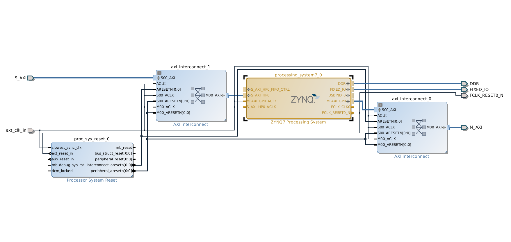

图中的AXI Interconnect和Processor System Reset都是用的Xilinx提供的IP核，不需要修改。ZYNQ7 Processing System这个IP需要基于自己的板卡进行配置，将其删除，新建一个，再阅读ax7z100手册，进行配置：

### 分配S AXI HP0接口

这个接口是提供给RISC-V核的，RISC-V核可以通过该接口来访问PS端的DDR内存。
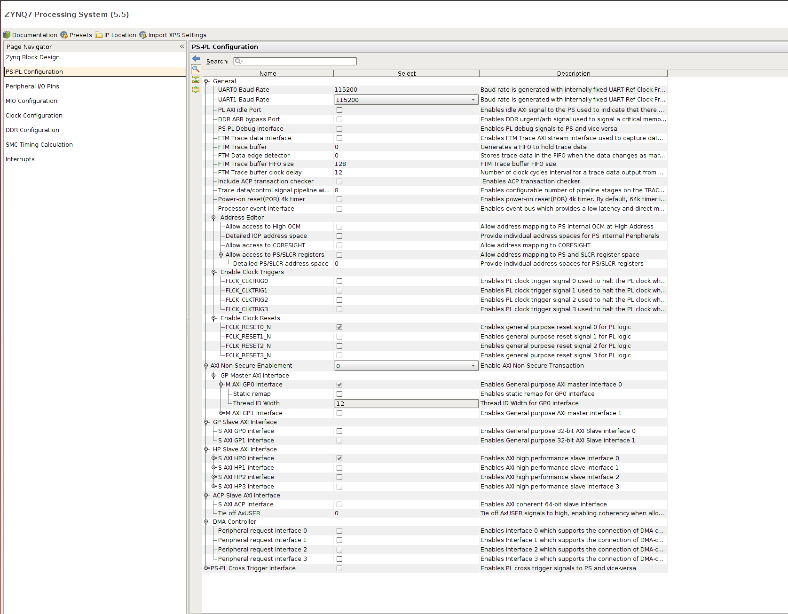

### 配置MIO

这里只需要配置QSPI、Ethernet、SD、UART、USB几个接口。

具体怎么配置，板卡手册都有明确的说明。注意，这里的接口会影响到后面soft_config/zynq_ax7z100.h的修改（我的板卡bank1需要设置成1.8V）。
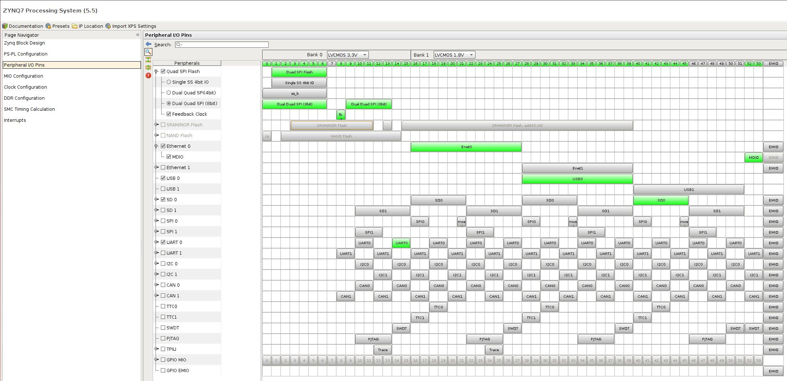

### 时钟配置

查阅自己的手册。这里配置的PS端参考时钟以及PS时钟产生器提供上述分配MIO接口的时钟。
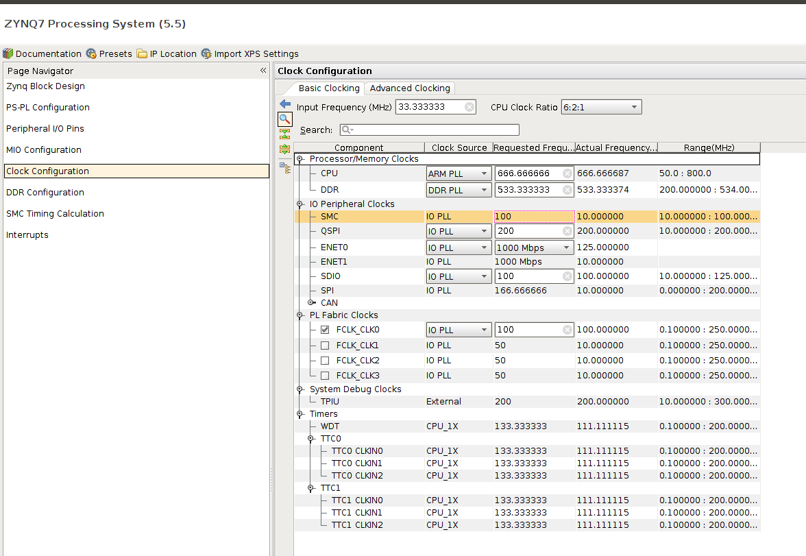

### DDR内存配置

阅读手册，选择DDR3的MT41J256M16 RE-125。如果使用的是zybo z7-20板卡，实践证明，内存可以选择DDR3L的MT41K256M16 RE-125（在helloworld demo中）。
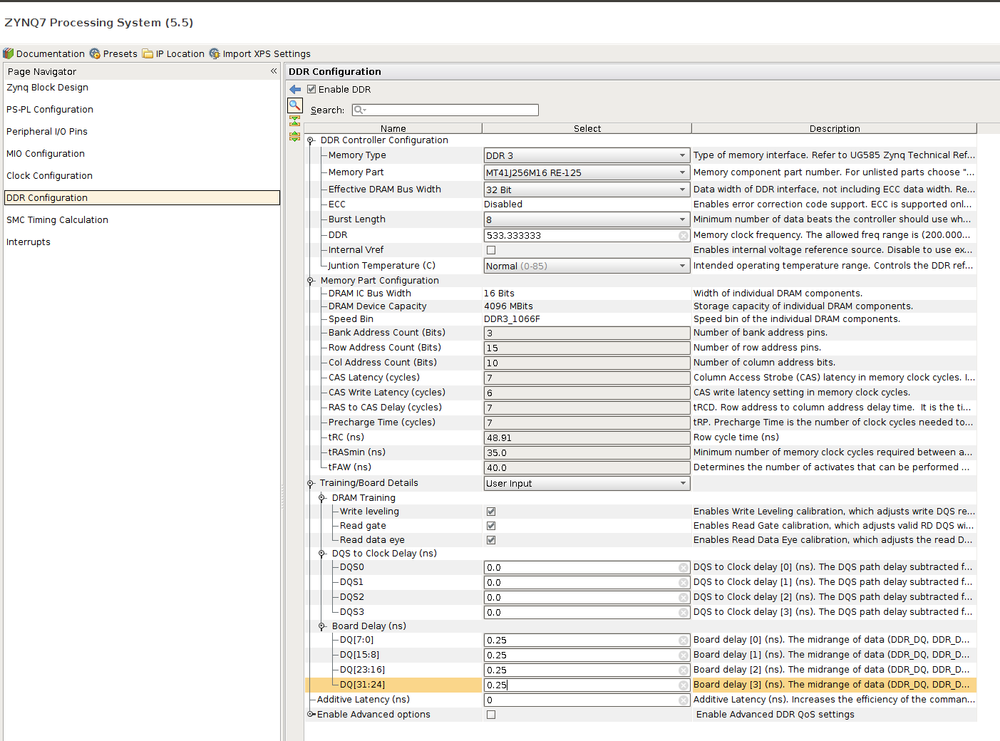

完成上述配置后，完成IP间的连线，Validate Design（可能提示需要进行Address Edit，右键使用自动地址分配就行了），保存block design。

附上我的Address Edit：
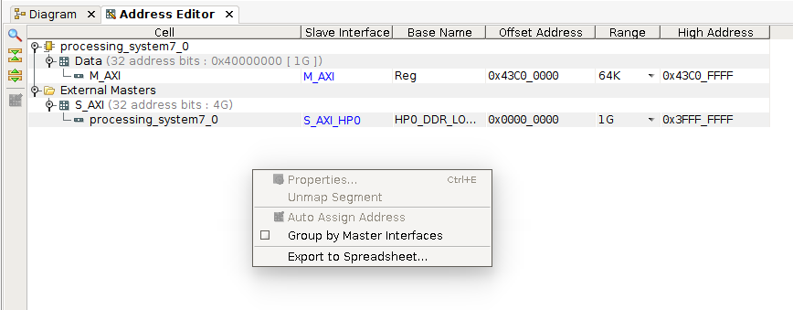

## 重新跑一遍vivado工程

保存block design后，重新跑一遍vivado工程。

- Generate Block Design
- Synthesis
- Implementation
- Generate Bitstream
- 导出硬件描述文件（给Xilinx SDK）

之后就可以按照github的README.md一步步走了。

## Build FSBL

File>New>Application Project，next
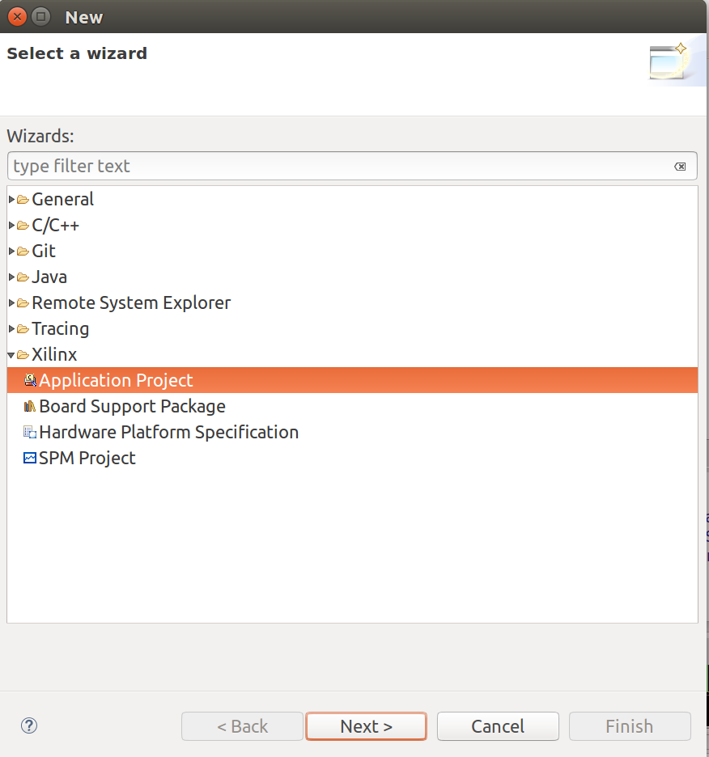

选择FSBL作为项目名，其他选项（standalone意思是裸机运行），next：
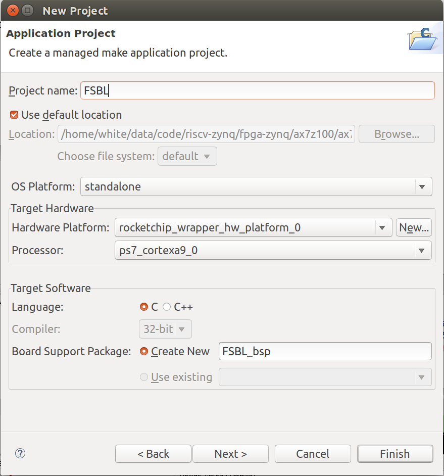

选择Zynq FSBL，finish。
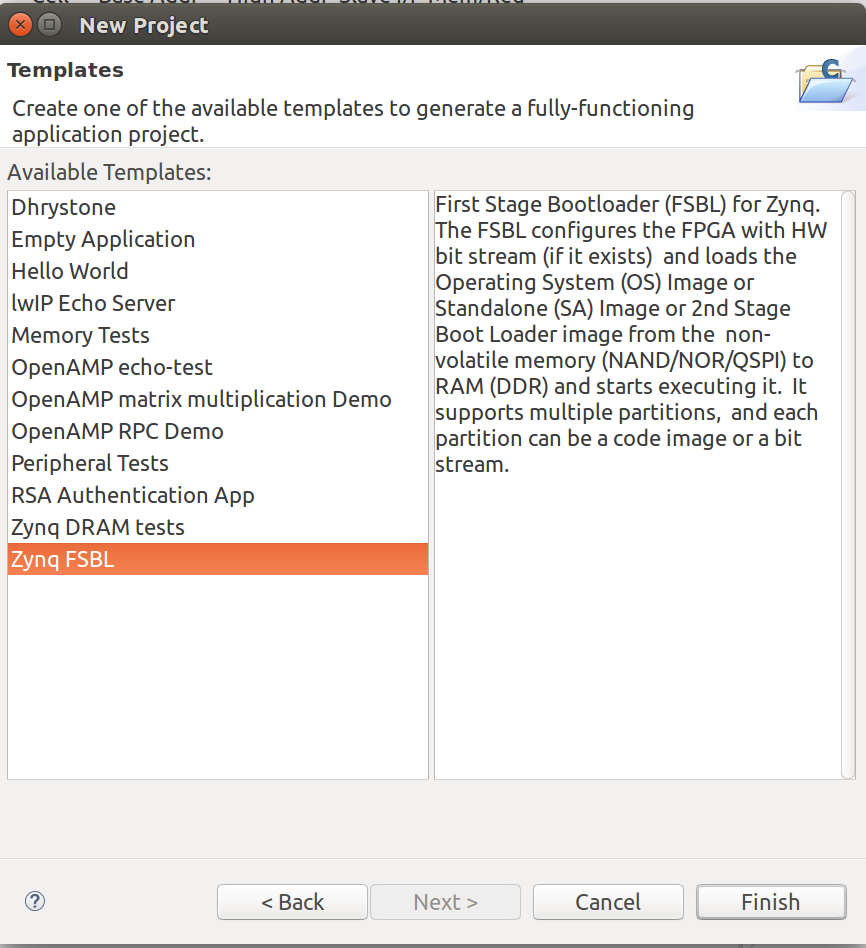

SDK将自动编译FSBL。

报错：
```Bash
07:17:59 **** Auto Build of configuration Debug for project FSBL ****
make pre-build main-build 
make[1]: Entering directory `/home/white/data/code/riscv-zynq/fpga-zynq/ax7z100/ax7z100_rocketchip_ZynqFPGAConfig/ax7z100_rocketchip_ZynqFPGAConfig.sdk/FSBL/Debug'
a9-linaro-pre-build-step
/bin/sh: 1: arm-none-eabi-gcc: not found
make[1]: *** [src/fsbl_handoff.o] Error 127
 
Building file: ../src/fsbl_handoff.S
Invoking: ARM v7 gcc compiler
arm-none-eabi-gcc -Wall -O0 -g3 -I"/home/white/data/code/riscv-zynq/fpga-zynq/ax7z100/ax7z100_rocketchip_ZynqFPGAConfig/ax7z100_rocketchip_ZynqFPGAConfig.sdk/rocketchip_wrapper_hw_platform_0" -c -fmessage-length=0 -MT"src/fsbl_handoff.o" -mcpu=cortex-a9 -mfpu=vfpv3 -mfloat-abi=hard -I../../FSBL_bsp/ps7_cortexa9_0/include -MMD -MP -MF"src/fsbl_handoff.d" -MT"src/fsbl_handoff.o" -o "src/fsbl_handoff.o" "../src/fsbl_handoff.S"
make[1]: Leaving directory `/home/white/data/code/riscv-zynq/fpga-zynq/ax7z100/ax7z100_rocketchip_ZynqFPGAConfig/ax7z100_rocketchip_ZynqFPGAConfig.sdk/FSBL/Debug'

07:17:59 Build Finished (took 129ms)
```

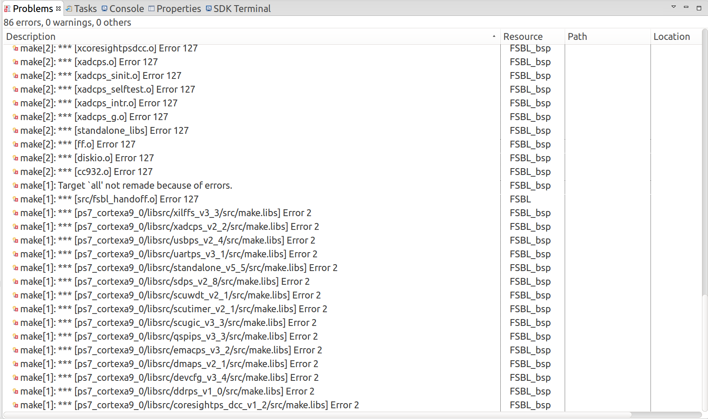

解决方法：
```Bash
sudo apt install gcc-arm-none-eabi

```

重新尝试，新的报错：
```Bash
08:15:08 **** Build of configuration Debug for project FSBL ****
make pre-build main-build 
make[1]: Entering directory `/home/white/data/code/riscv-zynq/fpga-zynq/ax7z100/ax7z100_rocketchip_ZynqFPGAConfig/ax7z100_rocketchip_ZynqFPGAConfig.sdk/FSBL/Debug'
a9-linaro-pre-build-step
 
Building file: ../src/fsbl_handoff.S
Invoking: ARM v7 gcc compiler
arm-none-eabi-gcc -Wall -O0 -g3 -I"/home/white/data/code/riscv-zynq/fpga-zynq/ax7z100/ax7z100_rocketchip_ZynqFPGAConfig/ax7z100_rocketchip_ZynqFPGAConfig.sdk/rocketchip_wrapper_hw_platform_0" -c -fmessage-length=0 -MT"src/fsbl_handoff.o" -mcpu=cortex-a9 -mfpu=vfpv3 -mfloat-abi=hard -I../../FSBL_bsp/ps7_cortexa9_0/include -MMD -MP -MF"src/fsbl_handoff.d" -MT"src/fsbl_handoff.o" -o "src/fsbl_handoff.o" "../src/fsbl_handoff.S"
arm-none-eabi-gcc: error trying to exec 'cc1': execvp: No such file or directory
make[1]: Leaving directory `/home/white/data/code/riscv-zynq/fpga-zynq/ax7z100/ax7z100_rocketchip_ZynqFPGAConfig/ax7z100_rocketchip_ZynqFPGAConfig.sdk/FSBL/Debug'
make[1]: *** [src/fsbl_handoff.o] Error 1

08:15:08 Build Finished (took 93ms)
```

参考：
[Error "arm-none-eabi-gcc: error trying to exec 'cc1' " - FPGA - Digilent Forum](https://forum.digilent.com/topic/2722-error-arm-none-eabi-gcc-error-trying-to-exec-cc1/)
[SDK can't find arm-xilinx-eabi-gcc](https://support.xilinx.com/s/question/0D52E00006iHk2BSAS/sdk-cant-find-armxilinxeabigcc?language=en_US&_ga=2.92699485.193697024.1701102354-1359800561.1701102354)

解决方法，安装32位库：
```Bash
sudo apt-get install lib32z1 lib32ncurses5 lib32bz2-1.0 lib32stdc++6
```

成功：
```Bash
08:40:32 **** Auto Build of configuration Debug for project FSBL ****
make pre-build main-build 
make[1]: Entering directory `/home/white/data/code/riscv-zynq/fpga-zynq/ax7z100/ax7z100_rocketchip_ZynqFPGAConfig/ax7z100_rocketchip_ZynqFPGAConfig.sdk/FSBL/Debug'
a9-linaro-pre-build-step
 
make[1]: Nothing to be done for `main-build'.
make[1]: Leaving directory `/home/white/data/code/riscv-zynq/fpga-zynq/ax7z100/ax7z100_rocketchip_ZynqFPGAConfig/ax7z100_rocketchip_ZynqFPGAConfig.sdk/FSBL/Debug'

08:40:32 Build Finished (took 112ms)
```

## 生成设备树文件（以zybo z7-20为例）

参考博客：[https://blog.csdn.net/ryuuei_1984/article/details/52367444](https://blog.csdn.net/ryuuei_1984/article/details/52367444)

#### 下载用于生成device-tree文件的资源包

在ubuntu下使用指令下载对应版本的资源包。
```Bash
git clone https://github.com/Xilinx/device-tree-xlnx.git
cd device-tree-xlnx
git checkout xilinx-v2016.2
```

#### SDK配置

将device-tree-xlnx文件夹拷贝到`~/opt/Xilinx/SDK/2016.2/data/embeddedsw/lib/bsp` 下，并重命名为device-tree-xlnx_v2016_2。 使用SDK打开建立的工程。然后打开Xilinx Tools > Respositories工具。在Local Repositories中点击New，加载到设备树资源包的目录，然后点击Rescan Repositories，点击OK完成配置，如图所示。
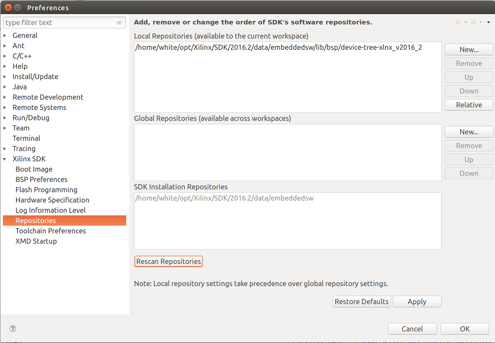

#### 创建设备树

点击File > New > Board Support Package，在弹出的窗口中，输入设备树的名字，并在Board Support Package OS选择`device_tree`。如图所示。
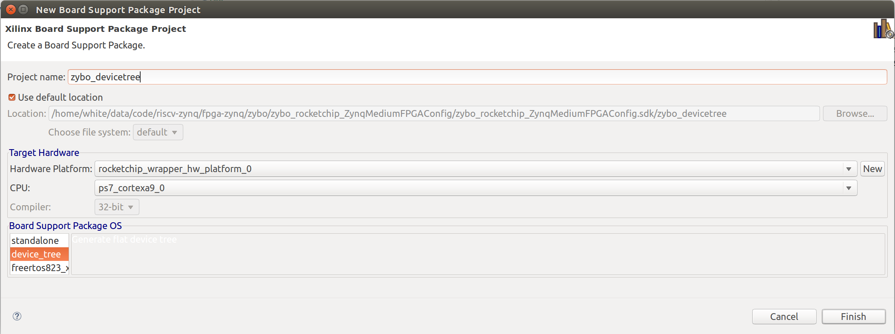

然后弹出Board Support Package Settings窗口，或者打开设备树项目的system.mss文件，点击Modify this BSP's Settings也可以打开，如图所示。
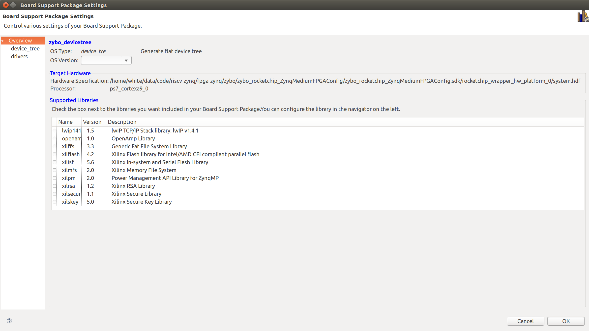

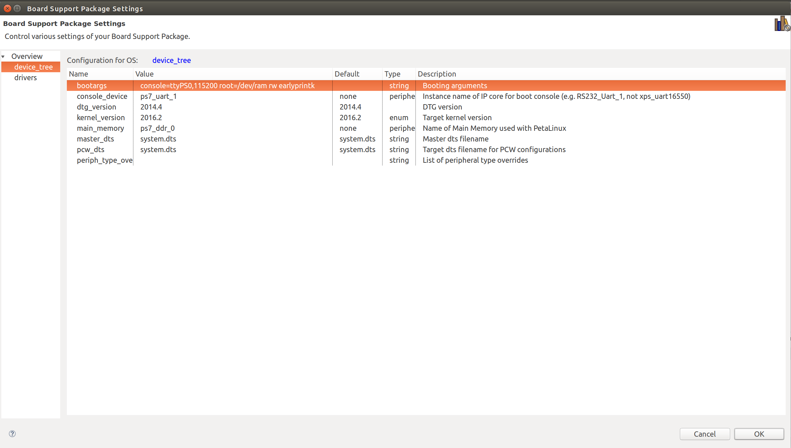

console device参数用于指定所使用的串口输出设备，在这里我们使用ps7_uart_1（**注意，这里是zybo z7-20**，而我的ax7z100用的是ps7_uart_0，不同板卡不一样）。

**这里我们需要配置的只有boot args**。

**boot args参数用于指定启动时传递给内核的参数。输入下面参数**：
```text
console=ttyPS0,115200 root=/dev/ram rw earlyprintk
```

- console：指定控制台的设备以及波特
- root：指定挂载的根文件系统，这里是/dev/ram
- rw：rw参数告诉内核以读写方式加载根文件系统。
- earlyprintk：在console设备注册前（也就是printk注册之前）提供对打印函数的支持，这个之前就可以使用early_printk()函数来代替printk()函数

然后点击”OK”生成设备树文件。

**ax7z100板卡的设备树文件生成同理。**

## Building u-boot

```Bash
make arm-uboot
```

make arm-uboot前，需要做以下准备工作：

### soft_config/zynq_ax7z100.h

复制zc706的，修改成以下的：
```text
/*
 * (C) Copyright 2013 Xilinx, Inc.
 * Modified by Sagar Karandikar for RISC-V Rocket Support
 *
 * u-boot Configuration settings for the Xilinx Zynq AX7Z100 boards
 * See zynq-common.h for Zynq common configs
 *
 * Adapted for RISC-V Rocket Support
 *
 * SPDX-License-Identifier:  GPL-2.0+
 */

#ifndef __CONFIG_ZYNQ_AX7Z100_H
#define __CONFIG_ZYNQ_AX7Z100_H

#define CONFIG_SYS_SDRAM_SIZE    (256 * 1024 * 1024)

#define CONFIG_ZYNQ_SERIAL_UART0
#define CONFIG_ZYNQ_GEM0
#define CONFIG_ZYNQ_GEM_PHY_ADDR0  1

#define CONFIG_SYS_NO_FLASH

#define CONFIG_ZYNQ_SDHCI0
#define CONFIG_ZYNQ_USB
#define CONFIG_ZYNQ_QSPI
#define CONFIG_ZYNQ_I2C0
#define CONFIG_ZYNQ_EEPROM
#define CONFIG_ZYNQ_BOOT_FREEBSD
#define CONFIG_DEFAULT_DEVICE_TREE  zynq-ax7z100

#include <configs/zynq-common.h>

#endif /* __CONFIG_ZYNQ_AX7Z100_H */

```

三处主要的修改：

- `#define CONFIG_ZYNQ_SERIAL_UART0`
    - 查阅手册，ax7z100使用的是UART0（MIO14-15）。
- `#define CONFIG_ZYNQ_GEM_PHY_ADDR0 1`
    - 查阅手册，ax7z100的PS端网口PHY Address是001。
- `#define CONFIG_DEFAULT_DEVICE_TREE zynq-ax7z100`
    - 后面需要在u-boot-xlnx里配置这个zynq-ax7z100。

### soft_config/boards.cfg

boards.cfg没有ax7z100的信息，参考其他zynq板卡添加一项。
```Bash
white@ubuntu:~/data/code/riscv-zynq/fpga-zynq/ax7z100/soft_config$ cp boards.cfg boards.cfg.copy
white@ubuntu:~/data/code/riscv-zynq/fpga-zynq/ax7z100/soft_config$ vim boards.cfg
white@ubuntu:~/data/code/riscv-zynq/fpga-zynq/ax7z100/soft_config$ diff -u ../../zc706/soft_config/boards.cfg boards.cfg
--- boards.cfg.copy  2023-11-27 00:01:28.921935764 -0800
+++ boards.cfg  2023-11-27 00:03:53.165941650 -0800
@@ -384,6 +384,7 @@
 Active  arm         armv7          vf610       freescale       vf610twr            vf610twr                              vf610twr:IMX_CONFIG=board/freescale/vf610twr/imximage.cfg                                                                         Alison Wang <b18965@freescale.com>
 Active  arm         armv7          zynq        xilinx          zynq                zynq_microzed                        -                                                                                                                                  Michal Simek <monstr@monstr.eu>:Jagannadha Sutradharudu Teki <jaganna@xilinx.com>
 Active  arm         armv7          zynq        xilinx          zynq                zynq_zc70x                           -                                                                                                                                  Michal Simek <monstr@monstr.eu>:Jagannadha Sutradharudu Teki <jaganna@xilinx.com>
+Active  arm         armv7          zynq        xilinx          zynq                zynq_ax7z100                         -                           -        
 Active  arm         armv7          zynq        xilinx          zynq                zynq_zc770_XM010                     zynq_zc770:ZC770_XM010                                                                                                             Michal Simek <monstr@monstr.eu>:Jagannadha Sutradharudu Teki <jaganna@xilinx.com>
 Active  arm         armv7          zynq        xilinx          zynq                zynq_zc770_XM011                     zynq_zc770:ZC770_XM011                                                                                                             Michal Simek <michal.simek@xilinx.com>
 Active  arm         armv7          zynq        xilinx          zynq                zynq_zc770_XM012                     zynq_zc770:ZC770_XM012                                                                                                             Michal Simek <monstr@monstr.eu>:Jagannadha Sutradharudu Teki <jaganna@xilinx.com>                                                                                                  Michal Simek <monstr@monstr.eu>:Jagannadha Sutradharudu Teki <jaganna@xilinx.com>
```

### 配置u-boot-xlnx

common目录下的u-boot-xlnx是make arm-uboot命令git下来的xilinx公司提供的u-boot工具。（进行一次失败的make arm-uboot获取u-boot，与前面提到的准备工作不矛盾）

参考：

[Linux系统移植一：移植U-BOOT 添加自己的板子并编译（非petalinux版）_zynq u-boot移植-CSDN博客](https://blog.csdn.net/qq_41873311/article/details/128138579)

直接git下来的u-boot-xlnx缺少对ax7z100板卡的支持，需要手动做一些修改。

之前通过Xilinx SDK生成了板卡有关的设备树文件：
```Bash
white@ubuntu:~/data/code/riscv-zynq/fpga-zynq/ax7z100/ax7z100_rocketchip_ZynqFPGAConfig/ax7z100_rocketchip_ZynqFPGAConfig.sdk/ax7z100_devicetree$ ls
Makefile  skeleton.dtsi  system.dts  system.mss  zynq-7000.dtsi

```

将skeleton.dtsi、system.dts、zynq-7000.dtsi复制到common/u-boot-xlnx/arch/arm/dts目录下，并将system.dts改名为zynq-ax7z100.dts。

之后修改common/u-boot-xlnx/arch/arm/dts/Makefile，添加一个zynq-ax7z100.dtb。

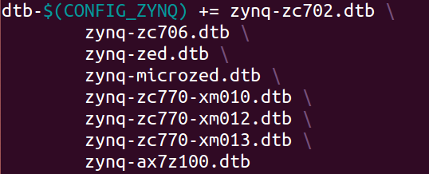

ax7z100/soft_config/ax7z100_config.h其实会经由make arm-uboot复制到u-boot-xlnx下的include/configs目录下，有关修改上面已经提到。

至此u-boot有关配置已经结束，可以make arm-uboot制作真正有用的uboot.elf了。

# Create BOOT.bin

Xilinx SDK里，Xilinx Tools -> Create Zynq Boot Image（找不到可以在Quick Access里搜索Create Boot Image）

选择output path为deliver_output：
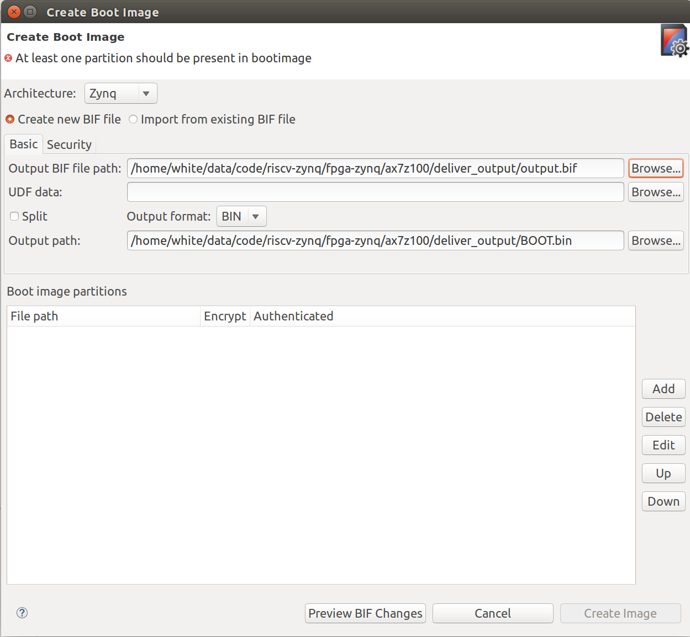

**按顺序**add：
1. FSBL.elf
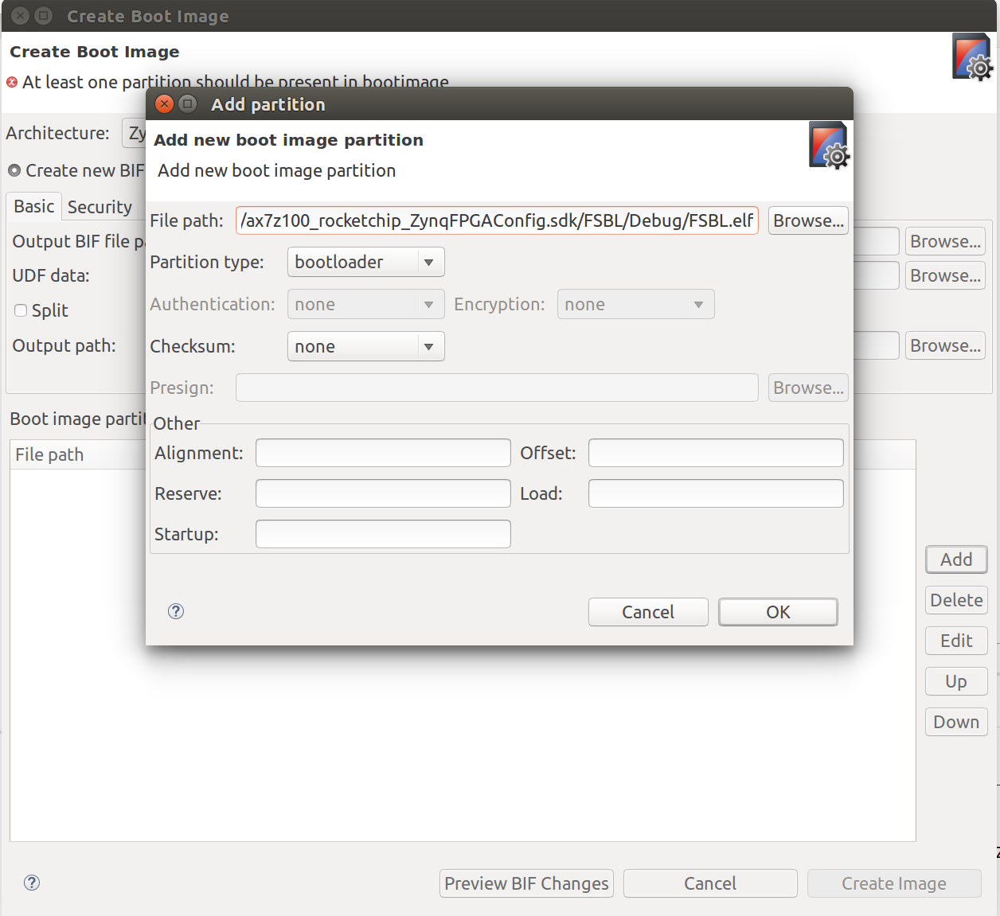

2. rocketchip_wrapper.bit
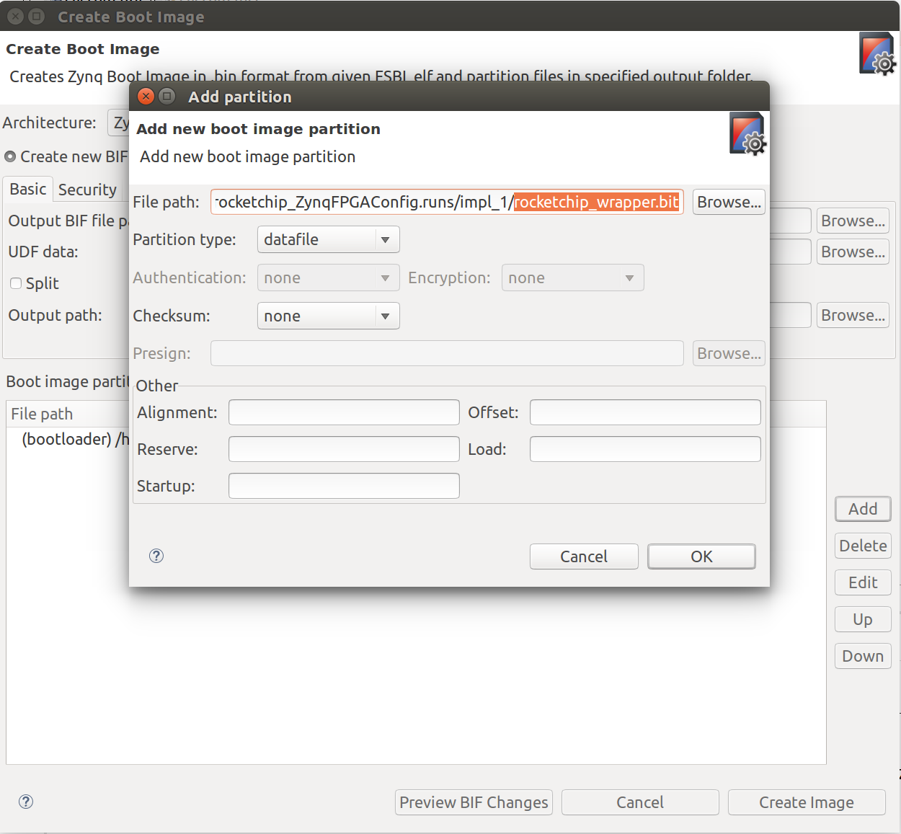

3. u-boot.elf
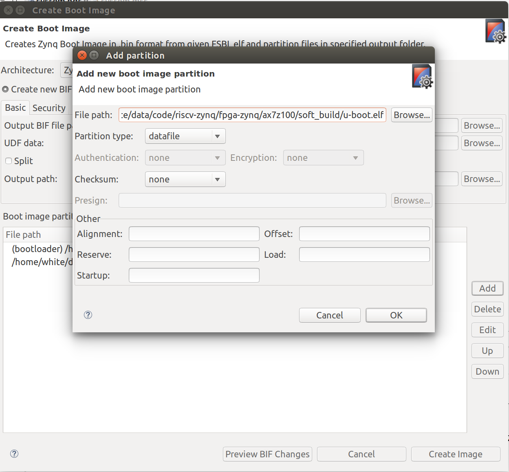

点击Create Image，得到：
```Bash
white@ubuntu:~/data/code/riscv-zynq/fpga-zynq/ax7z100$ ls deliver_output/
BOOT.bin  output.bif

```

# Build Linux

### make arm-linux

make arm-linux，没有问题。

网络原因git总是失败怎么办，[编写一个重复git直至成功的脚本test.sh](http://xn--gittest-4t3kgm260ar0ci62a8y0ai7ooj8ceqbb54eyuhy7dy48h.sh)：
```Bash
git submodule update --init /home/white/data/code/riscv-zynq/fpga-zynq/common/linux-xlnx
while [ $? -gt 0 ];  
do  
git submodule update --init /home/white/data/code/riscv-zynq/fpga-zynq/common/linux-xlnx    
done
```

### make arm-dtb
make arm-dtb前，准备好`soft_config/ax7z100_devicetree.dts`。

将Xilinx SDK生成好的设备树文件复制到ax7z100/soft_config目录下，并将system.dts改名为ax7z100_devicetree.dts：
```Bash
white@ubuntu:~/data/code/riscv-zynq/fpga-zynq/ax7z100/ax7z100_rocketchip_ZynqFPGAConfig/ax7z100_rocketchip_ZynqFPGAConfig.sdk/ax7z100_devicetree$ ls
Makefile  skeleton.dtsi  system.dts  system.mss  zynq-7000.dtsi
white@ubuntu:~/data/code/riscv-zynq/fpga-zynq/ax7z100/ax7z100_rocketchip_ZynqFPGAConfig/ax7z100_rocketchip_ZynqFPGAConfig.sdk/ax7z100_devicetree$ cp skeleton.dtsi system.dts zynq-7000.dtsi  ~/data/code/riscv-zynq/fpga-zynq/ax7z100/soft_config/
white@ubuntu:~/data/code/riscv-zynq/fpga-zynq/ax7z100/ax7z100_rocketchip_ZynqFPGAConfig/ax7z100_rocketchip_ZynqFPGAConfig.sdk/ax7z100_devicetree$ cd ~/data/code/riscv-zynq/fpga-zynq/ax7z100/soft_config/
white@ubuntu:~/data/code/riscv-zynq/fpga-zynq/ax7z100/soft_config$ ls
boards.cfg  skeleton.dtsi  system.dts  zynq-7000.dtsi  zynq_ax7z100.h
white@ubuntu:~/data/code/riscv-zynq/fpga-zynq/ax7z100/soft_config$ mv system.dts ax7z100_devicetree.dts

```

执行make arm-dtb：
```Bash
white@ubuntu:~/data/code/riscv-zynq/fpga-zynq/ax7z100$ make arm-dtb 
export PATH=/home/white/data/code/riscv-zynq/fpga-zynq/common/linux-xlnx/scripts/dtc:$PATH && dtc -I dts -O dtb -o deliver_output/devicetree.dtb soft_config/ax7z100_devicetree.dts

```

### make fetch-ramdisk

执行make fetch-ramdisk ：
```Bash
white@ubuntu:~/data/code/riscv-zynq/fpga-zynq/ax7z100$ make fetch-ramdisk 
mkdir -p deliver_output
curl https://s3-us-west-1.amazonaws.com/riscv.org/fpga-zynq-files/uramdisk.image.gz > deliver_output/uramdisk.image.gz
  % Total    % Received % Xferd  Average Speed   Time    Time     Time  Current
                                 Dload  Upload   Total   Spent    Left  Speed
100   435    0   435    0     0    432      0 --:--:--  0:00:01 --:--:--   432

```

# 上板测试

现在SD卡启动需要的文件都准备好了：
```Bash
white@ubuntu:~/data/code/riscv-zynq/fpga-zynq/ax7z100$ ls deliver_output/
BOOT.bin  devicetree.dtb  output.bif  uImage  uramdisk.image.gz

```

将BOOT.bin devicetree.dtb uImage uramdisk.image.gz四个拷贝到SD卡根目录下：
```Bash
white@ubuntu:/media/white/9F5E-B7F1$ cp ~/data/code/riscv-zynq/fpga-zynq/ax7z100/deliver_output/* -r ./
white@ubuntu:/media/white/9F5E-B7F1$ ls
BOOT.bin  devicetree.dtb  output.bif  uImage  uramdisk.image.gz
white@ubuntu:/media/white/9F5E-B7F1$ rm output.bif 
white@ubuntu:/media/white/9F5E-B7F1$ ls
BOOT.bin  devicetree.dtb  uImage  uramdisk.image.gz
white@ubuntu:/media/white/9F5E-B7F1$ 
```

可以通过screen来监听串口：
```
sudo screen /dev/ttyUSB0 115200,cs8,-parenb,-cstopb
```

测试过程中，串口输出有时会卡住，重试几次后成功。

# 其他

笔者也针对zybo z7-20进行过移植，踩过一些坑。

注意区分zybo和zybo z7：
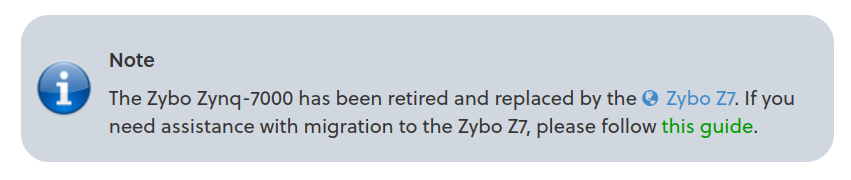

zybo：
[https://digilent.com/reference/programmable-logic/zybo/reference-manual](https://digilent.com/reference/programmable-logic/zybo/reference-manual)

zybo z7：
[https://digilent.com/shop/zybo-z7-zynq-7000-arm-fpga-soc-development-board/](https://digilent.com/shop/zybo-z7-zynq-7000-arm-fpga-soc-development-board/)

